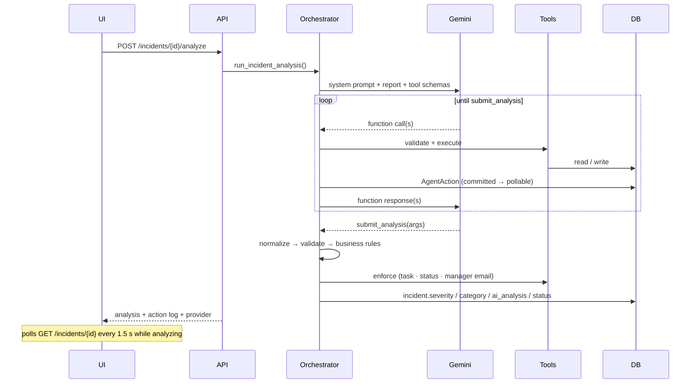

# FleetPilot AI — Architecture

See `solution-design.md` for the role research, prioritization and functional specification. This document is the technical map.

## System

```mermaid
graph TD
    UI[React UI<br/>Vite + Tailwind]
    API[FastAPI REST API]
    ORCH[Agent Orchestrator<br/>tool loop · normalize · rules · enforce]
    SCAN[Proactive Scan]
    SCHED[APScheduler]
    EXT[Cloud Scheduler / GitHub Actions]
    LLM[Gemini 3.6 Flash<br/>(Groq optional)]
    TOOLS[Tool Handlers]
    DB[(PostgreSQL)]
    NHTSA[NHTSA vPIC + Recalls]
    RESEND[Resend Email]

    UI -->|REST + polling| API
    API --> ORCH
    API --> SCAN
    SCHED --> SCAN
    EXT -->|X-Scheduler-Token| API
    ORCH <-->|function calling| LLM
    SCAN -->|digest| LLM
    ORCH --> TOOLS
    TOOLS --> DB
    TOOLS --> NHTSA
    TOOLS --> RESEND
    SCAN --> DB
    SCAN --> NHTSA
    SCAN --> RESEND
```

## Agent loop



## Key design decisions

1. **The model never touches the database or external APIs directly.** Every action goes through a typed tool handler that validates arguments and returns a plain result.
2. **Terminal tool.** The verdict is delivered by calling `submit_analysis`; free-text finals are only a fallback. Reasoning models otherwise fail to stop cleanly.
3. **Normalize → validate → rules → enforce.** Raw arguments are coerced into `IncidentAnalysis` (unknown category → UNKNOWN, invalid severity → rejected). Business rules are deterministic Python. `_enforce_actions` guarantees consequences (task exists, status escalated, manager emailed) regardless of which tools the model chose to call.
4. **Per-action commits** give the UI a live timeline without WebSockets.
5. **Provider abstraction.** One JSON-Schema tool definition; adapters translate for Gemini (recursive `Schema`, all function calls in a turn answered together, `to_dict` for proto args, thread-offloaded calls, 429 back-off) and Groq (OpenAI-compatible). Provider/model/key switch at runtime.
6. **Proactive layer is deterministic-first, LLM-last.** Facts (intervals, recalls, stale approvals) come from code; the LLM only writes the digest. Tasks are deduplicated by vehicle + title, recalls are cached 24 h, reminders have a cooldown.
7. **Graceful degradation, visibly.** No key → demo mode, labelled in the UI and the action log. No Resend key → `SIMULATED`. NHTSA down → error object, analysis continues.
8. **Idempotent seed** with `--reset` for a clean demo database; enum values are synced on startup for existing databases.

## Database schema

```
vehicles              id, fleet_number, vin, make, model, year, mileage, status, fuel_type,
                      last_service_date, next_service_mileage
maintenance_records   id, vehicle_id → vehicles, maintenance_type, description, mileage, performed_at, status
incidents             id, vehicle_id → vehicles, reported_by, description, severity, category, status, ai_analysis (JSON)
maintenance_tasks     id, vehicle_id → vehicles, incident_id → incidents, title, description, severity,
                      status, assigned_to, due_date, ai_generated
parts_requests        id, maintenance_task_id → maintenance_tasks, part_name, quantity, priority, status
notifications         id, recipient, channel (EMAIL | IN_APP), subject, message, status
                      (SENT | SIMULATED | FAILED), related_entity_type, related_entity_id
agent_actions         id, incident_id → incidents (nullable for scans), action_type, description, status,
                      tool_name, tool_input (JSON), tool_output (JSON), created_at, completed_at
```

## Status machines

- **Vehicle:** `ACTIVE → MAINTENANCE_DUE → OUT_OF_SERVICE` (analysis may only escalate; completion of the last open task returns to `ACTIVE`).
- **Incident:** `NEW → ANALYZING → AWAITING_APPROVAL | APPROVED → IN_PROGRESS → RESOLVED`, or `REJECTED`.
- **Task:** `PENDING_APPROVAL → APPROVED → IN_PROGRESS → COMPLETED`, or `CANCELLED`.
