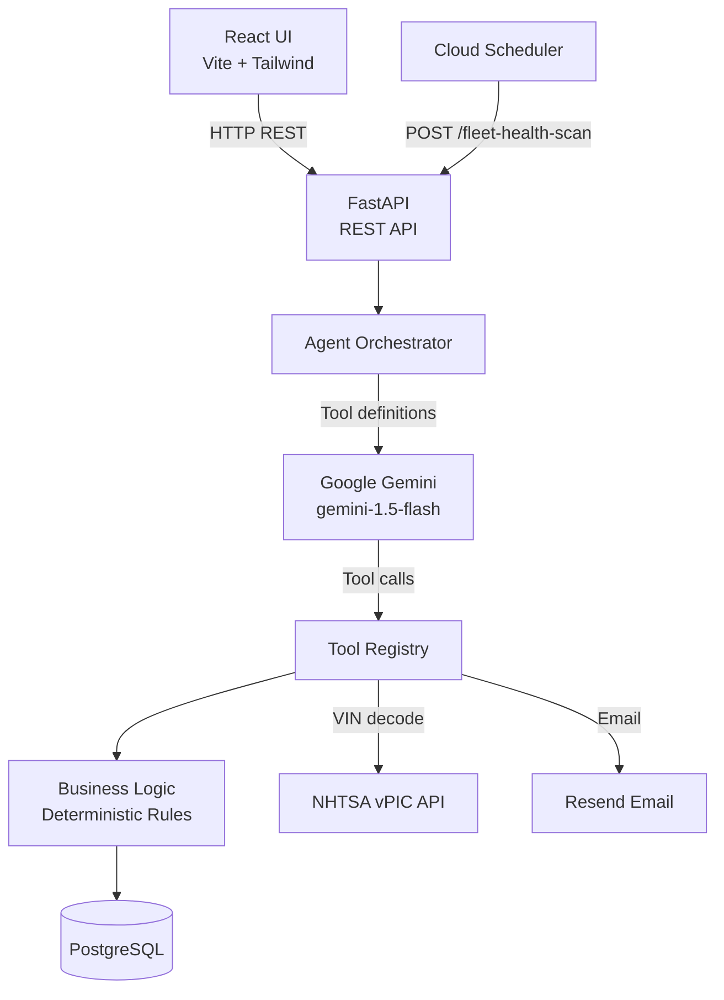
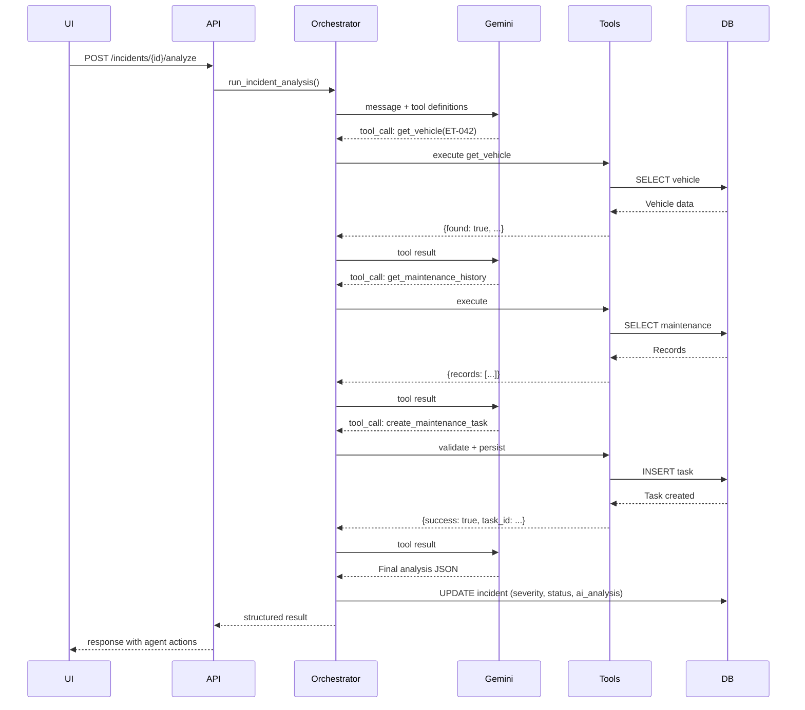

# FleetPilot AI — Architecture

## System Architecture



## Agent Tool-Calling Loop



## Key Design Decisions

### 1. Gemini never accesses the database directly
All database operations go through typed tool handler functions. Gemini can only request actions; the backend validates and executes them.

### 2. Deterministic business rules in Python
Severity → vehicle status transitions, approval requirements, and notification rules are implemented in `_apply_business_rules()` in Python. The LLM recommends; the backend enforces.

### 3. Demo mode without Gemini key
When `GEMINI_API_KEY` is not configured, the orchestrator falls back to keyword-based classification. This allows the demo to run without an API key while all tool calls, database operations, and UI flows still work correctly.

### 4. Idempotent seed
The seed script checks for existing records before inserting, making it safe to run multiple times.

### 5. Graceful external API degradation
- NHTSA timeout → return error, application continues
- Resend missing key → simulate email, log as SIMULATED
- Gemini unavailable → demo mode classification

## Database Schema

```
vehicles
  id, fleet_number, vin, make, model, year, mileage,
  status, fuel_type, last_service_date, next_service_mileage

maintenance_records
  id, vehicle_id → vehicles, maintenance_type,
  description, mileage, performed_at, status

incidents
  id, vehicle_id → vehicles, reported_by, description,
  severity, category, status, ai_analysis (JSONB)

maintenance_tasks
  id, vehicle_id → vehicles, incident_id → incidents,
  title, description, severity, status, ai_generated, due_date

parts_requests
  id, maintenance_task_id → maintenance_tasks,
  part_name, quantity, priority, status

notifications
  id, recipient, channel, subject, message, status,
  related_entity_type, related_entity_id

agent_actions
  id, incident_id → incidents, action_type, description,
  status, tool_name, tool_input (JSONB), tool_output (JSONB),
  created_at, completed_at
```
