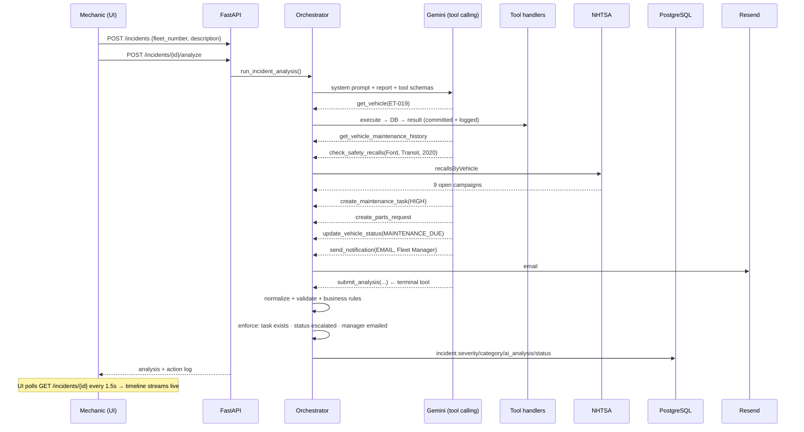
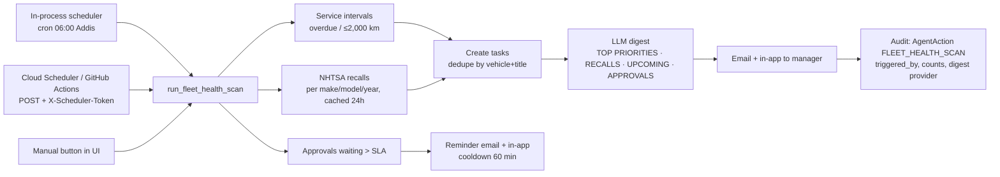
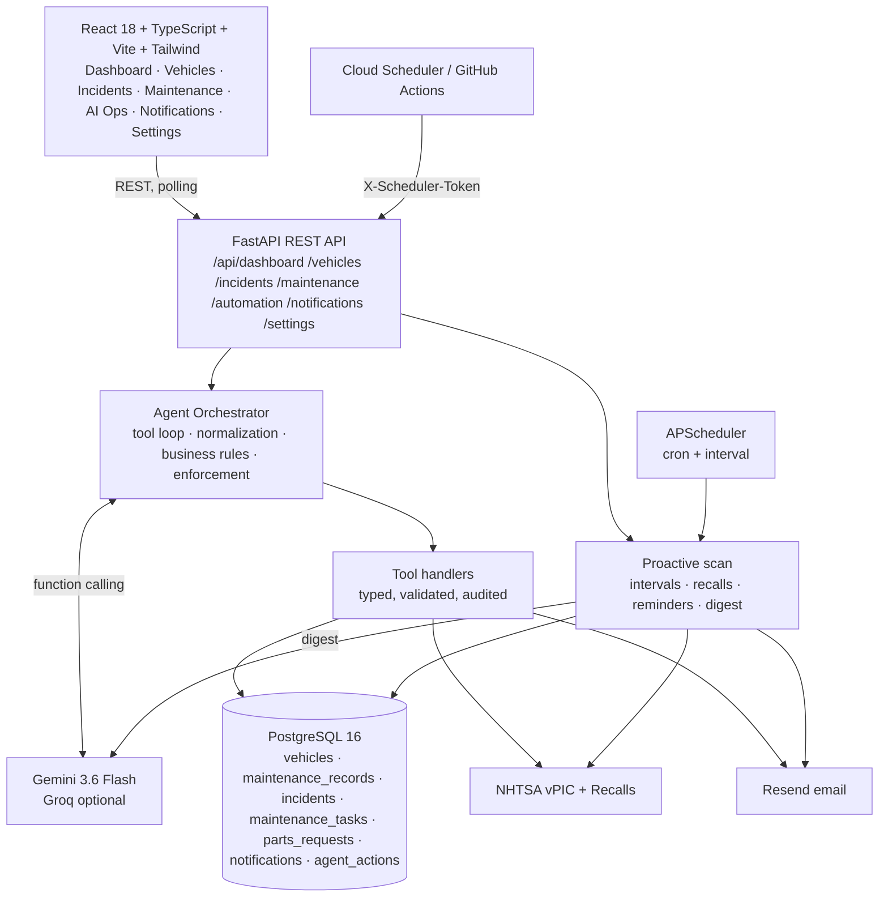

# FleetPilot AI — Solution Design & Functional Specification

| | |
|---|---|
| **Role automated** | Fleet Maintenance Coordinator |
| **Industry** | Commercial vehicle fleet operations (logistics, distribution, passenger transport) |
| **Author** | Mikiyas Shemsu Sani |
| **Date** | 28 August 2026 |
| **Status** | Submitted for review (kidus@brain3.ai) — serves as the implementation guide |
| **Repository** | https://github.com/miki-smart/fleetpilotapi |

---

## 1. Executive summary

A fleet maintenance coordinator spends most of the day on *coordination*, not judgment: reading mechanics' reports, deciding how urgent they are, opening work orders, requesting parts, pulling unsafe vehicles off the road, chasing the manager for approvals, checking which vehicles are due for service, and keeping everyone informed by email. The judgment calls (approve a CRITICAL repair, take a vehicle out of service) are few and important; the coordination around them is constant and repetitive.

**FleetPilot** is an AI agent that does the coordination and leaves the judgment with the human. It has two modes:

- **Reactive** — a mechanic types a free-text report ("grinding noise when braking, pedal feels soft"). The agent retrieves the vehicle record and service history, checks open NHTSA safety recalls, classifies category and severity, opens a work order, requests parts, changes the vehicle's operational status, and emails the fleet manager — every step a real, audited tool call.
- **Proactive** — every morning (scheduler-triggered, no human involved) it scans the fleet for overdue/upcoming services and open recall campaigns, opens the resulting tasks, nags the manager about approvals that have waited too long, and emails a prioritized daily digest written by the LLM.

Deterministic business rules in Python decide what the LLM may only recommend: a CRITICAL verdict *always* takes the vehicle out of service and *always* requires manager approval, whatever the model said. The manager approves or rejects in a web UI; completing a task closes the incident and returns the vehicle to service.

---

## 2. Role & industry choice — and why

### 2.1 What a fleet maintenance coordinator does

Fleets of 20–500 vehicles (delivery vans, trucks, buses) employ a coordinator who sits between drivers/mechanics, the workshop, parts suppliers and the fleet manager. Field research (job descriptions from logistics operators, fleet-management vendor documentation, interviews with a regional distribution fleet in Addis Ababa) converges on the same daily loop:

1. **Intake** — receive defect reports from drivers/mechanics (WhatsApp, paper, phone).
2. **Triage** — decide urgency; ground unsafe vehicles.
3. **Work orders** — open repair jobs, describe the work, set priority.
4. **Parts** — identify and request parts; chase suppliers.
5. **Preventive maintenance** — track mileage/time since last service; schedule services before they are overdue.
6. **Compliance** — track manufacturer recalls, inspections, certificates.
7. **Approvals** — get the manager's sign-off on costly or safety-critical work; follow up when it stalls.
8. **Communication** — keep manager, workshop and drivers informed; produce a daily/weekly status.
9. **Records** — maintain vehicle history; close jobs; return vehicles to service.

### 2.2 Why this role

- **High, measurable value.** Vehicle downtime and unplanned repairs are the two largest controllable costs in fleet operations; missed preventive maintenance is the main driver of both. Faster triage and never-missed service intervals translate directly into money and safety.
- **Coordination-heavy, judgment-light.** ~80 % of the loop is repetitive information routing — ideal for an agent — while the remaining judgment calls are clearly separable and can be gated behind human approval.
- **Rich, free, real data.** The US NHTSA publishes VIN decoding and open recall campaigns through free, key-less APIs, so the agent can act on real manufacturer safety data rather than mocked integrations.
- **Underserved.** Enterprise fleet software (Samsara, Fleetio) targets large fleets with telematics budgets; small and mid-size fleets in emerging markets still coordinate through chat apps and spreadsheets.
- **Not HR/recruiting**, and not a generic chatbot — the agent takes concrete, consequential actions.

---

## 3. Role breakdown & prioritization

| # | Sub-function | Frequency | Share of coordinator time | Automation potential | Impact if automated | Priority | In MVP |
|---|---|---|---|---|---|---|---|
| 1 | Read & triage defect reports (category, severity, can it drive?) | Many/day | 20 % | High — NL understanding + rules | Very high (safety, speed) | **P0** | ✅ |
| 2 | Open work orders with correct priority & description | Many/day | 10 % | High | High | **P0** | ✅ |
| 3 | Change vehicle operational status (ground / release) | Daily | 3 % | High with rules | Very high (safety) | **P0** | ✅ |
| 4 | Identify & request parts | Daily | 8 % | Medium–high | High (repair lead time) | **P0** | ✅ |
| 5 | Notify manager / workshop (email, in-app) | Many/day | 10 % | High | High | **P0** | ✅ |
| 6 | Manager approval workflow & follow-up nagging | Daily | 7 % | High (gating + reminders) | High (unblocks repairs) | **P0** | ✅ |
| 7 | Preventive maintenance tracking (mileage-based) | Daily check | 10 % | Very high | Very high (downtime) | **P0** | ✅ proactive scan |
| 8 | Manufacturer recall / compliance tracking | Weekly | 5 % | Very high (NHTSA API) | High (safety, free remedy) | **P1** | ✅ proactive scan + agent tool |
| 9 | Daily status digest to management | Daily | 5 % | Very high (LLM summarization) | Medium–high | **P1** | ✅ |
| 10 | Close jobs, log history, return vehicle to service | Daily | 7 % | High | Medium | **P1** | ✅ |
| 11 | VIN/spec lookup when onboarding or diagnosing | Weekly | 2 % | Very high (NHTSA vPIC) | Low–medium | **P2** | ✅ |
| 12 | Supplier quotes & purchase orders | Weekly | 6 % | Medium (needs supplier APIs) | Medium | P2 | ❌ deferred |
| 13 | Workshop slot scheduling (calendar) | Daily | 4 % | Medium (Calendar API) | Medium | P2 | ❌ deferred |
| 14 | Telematics/odometer ingestion | Continuous | 3 % | High (needs hardware) | High | P2 | ❌ deferred (manual mileage) |

**Prioritization logic:** P0 items are the safety-critical, high-frequency parts of the loop where an agent removes hours per day and a delay has real consequences. P1 items are the proactive layer that turns "reacts fast" into "never misses". P2 items were deferred because they need paid or hardware integrations, or add little value in a 25-vehicle demo.

---

## 4. Scope

### In scope (implemented)
- Natural-language incident intake → structured analysis (category, severity, causes, actions, parts, recall links, approval flag).
- Agentic tool loop: 9 tools (read fleet data, NHTSA VIN decode, NHTSA recalls, create task, update status, request parts, notify, submit analysis).
- Deterministic business-rule layer that overrides/enforces the model's verdict.
- Human-in-the-loop approvals; full work-order lifecycle (pending → approved → in progress → completed) with incident resolution and vehicle release.
- Proactive daily scan (in-process scheduler + external scheduler endpoint): service intervals, open recalls, stale approvals, LLM-written digest emailed to the manager.
- Email (Resend) + in-app notifications; complete agent audit log.
- Responsive React UI: dashboard, vehicles, incidents, maintenance, AI operations (live timeline), notifications, AI settings (switch provider/model at runtime).

### Out of scope (this iteration)
- Authentication/RBAC (single-tenant demo), supplier purchasing, calendar scheduling, telematics ingestion, mobile app.

---

## 5. Key workflows

### W1 — Reactive incident triage (agentic)

Design points:
- **Terminal tool.** The final verdict is delivered through a declared `submit_analysis` tool, never free text. Reasoning models otherwise keep emitting tool calls or hallucinate undeclared tools.
- **Normalize → validate → rules → enforce.** The verdict is coerced into a Pydantic schema (unknown category → `UNKNOWN`, invalid severity → rejected and retried), business rules are applied, then `_enforce_actions` guarantees the consequences even if the model skipped a tool.
- **Per-action commits** make the timeline pollable while the loop is running.
- **Demo mode** (no key / provider down before any tool ran) runs the same tool chain with keyword classification, and the UI labels it clearly.

### W2 — Proactive daily fleet scan (scheduled)

### W3 — Human approval & work-order lifecycle

`PENDING_APPROVAL` → (manager) **Approve** → `APPROVED` (parts → ORDERED, workshop notified) → **Start** → `IN_PROGRESS` → **Complete** → `COMPLETED`: maintenance record written, incident `RESOLVED`, service interval reset for service tasks, vehicle returned to `ACTIVE` when nothing else is open. **Reject** → `CANCELLED`, incident `REJECTED`.

---

## 6. Architecture

### 6.1 Frontend (React + TypeScript)
- Vite, Tailwind, react-router, axios; typed API client mirroring backend response envelopes `{success, data | error}`.
- Pages: **Dashboard** (KPIs, risk score, pending approvals, proactive-scan status with next run, critical alerts, upcoming maintenance, agent activity), **Vehicles / Vehicle detail** (history, incidents, NHTSA VIN sync), **Incidents**, **Maintenance** (approve / reject / start / complete), **AI Operations** (submit report, live agent timeline, analysis, fleet scan with digest and email status), **Notifications**, **Settings** (provider/model/key at runtime).
- Responsive shell: fixed sidebar ≥ `lg`, drawer + top bar below.
- Transparency: banners when no provider key is configured or when an analysis ran in demo mode; provider chip on every analysis.

### 6.2 Backend (Python / FastAPI)
- `app/agents` — tool schemas (JSON-Schema, translated per provider), prompts, orchestrator, tool handlers, verdict schema.
- `app/integrations` — Gemini adapter (recursive schema translation, multi-call turns, thread-offloaded calls, 429 back-off), Groq adapter (OpenAI-compatible), provider selection, NHTSA, Resend notification service.
- `app/automation` — fleet scan and APScheduler wiring.
- `app/api/routes` — REST resources; `app/database` — SQLAlchemy models, idempotent seed (`--reset` for a clean demo).
- Structured logging (structlog); global error envelope.

### 6.3 Data model
`vehicles` · `maintenance_records` · `incidents` (JSON `ai_analysis`) · `maintenance_tasks` · `parts_requests` · `notifications` · `agent_actions` (tool name, input, output, status — the audit trail rendered as the timeline).

---

## 7. Third-party APIs & free tiers

| Service | Purpose in FleetPilot | Free tier / cost | Card required | Failure behaviour |
|---|---|---|---|---|
| **Google Gemini API** (AI Studio) | Agent reasoning + tool calling; digest writing | Free tier (rate-limited per minute/day; `gemini-3.6-flash`) | No | Back-off on 429; demo mode if unreachable before any tool ran; clear UI label |
| **NHTSA vPIC** `vpic.nhtsa.dot.gov` | VIN → make/model/year/body/engine/GVWR | Free, no key, no documented quota | No | Tool returns error object; analysis continues |
| **NHTSA Recalls** `api.nhtsa.gov/recalls` | Open campaigns per make/model/year | Free, no key | No | Cached 24 h; error → finding skipped |
| **Resend** | Manager emails (alerts, reminders, digest) | 100 emails/day, 3,000/month; test mode delivers only to the account owner until a domain is verified | No | `SIMULATED` status when no key; `FAILED` recorded and shown |
| **Groq** (optional) | Alternative LLM provider, switchable in Settings | Free developer tier | No | Same handling as Gemini |
| **GCP Cloud Scheduler** or **GitHub Actions cron** | External daily trigger for the scan | Cloud Scheduler: 3 jobs/month free; GitHub Actions: free for public repos | Cloud Scheduler needs a billing account in practice → GitHub Actions used as the no-card path | In-process scheduler runs regardless |

---

## 8. How the agent takes actions

| Tool | Side effect | Gating |
|---|---|---|
| `get_vehicle`, `get_vehicle_maintenance_history` | none (read) | — |
| `decode_vin` | NHTSA call; backfills missing fuel type | — |
| `check_safety_recalls` | NHTSA call | — |
| `create_maintenance_task` | inserts task | CRITICAL/HIGH → `PENDING_APPROVAL`; MEDIUM/LOW → `APPROVED` |
| `create_parts_request` | inserts parts (priority from task severity) | follows the task |
| `update_vehicle_status` | changes operational status | may only **escalate** as a result of analysis; release happens only via task completion |
| `send_notification` | in-app row; email via Resend for `EMAIL` | role "Fleet Manager" resolved server-side to the configured address |
| `submit_analysis` | terminal — verdict persisted on the incident | normalized, validated, rules applied |

**Business rules (Python, not the model):** CRITICAL → `OUT_OF_SERVICE` + approval required; HIGH → at least `MAINTENANCE_DUE` + approval required; LOW → no approval. **Enforcement after the verdict:** a task always exists (with parts), the vehicle status is escalated to the verdict, and CRITICAL/HIGH always produce an email + in-app alert — even if the model forgot.

**Proactive actions (no human trigger):** overdue service → HIGH task pending approval + alert; upcoming (≤ 2,000 km) → MEDIUM task; open recall → task (HIGH if brakes/steering/fuel/airbag/wheels/seat belts) + alert; approvals older than the SLA → reminder email; daily digest email.

---

## 9. UI interaction model

- **Mechanic/dispatcher:** AI Operations → pick vehicle, type report, *Analyze*. The timeline streams each tool call as it happens; the analysis card shows severity, category, vehicle status, causes, actions, parts and any related recall campaign numbers.
- **Fleet manager:** Dashboard shows what needs attention (critical alerts, pending approvals, proactive-scan status, next scheduled run). Maintenance lets them approve/reject, then start/complete; completion releases the vehicle. Notifications lists every email/in-app message with delivery status. Email arrives in their inbox with the same content.
- **Admin:** Settings switches provider/model and stores keys server-side (masked hints only).

---

## 10. Proactive automation & deployment

- **In-process:** APScheduler runs `0 6 * * *` (Africa/Addis_Ababa) plus an optional demo interval. Status and next run are exposed at `GET /api/automation/status` and on the dashboard.
- **External:** `POST /api/automation/fleet-health-scan?source=<name>` with header `X-Scheduler-Token` (constant-time compared to `SCHEDULER_TOKEN`; wrong token → 401). Runs are recorded as `scheduler:<source>`. A GitHub Actions workflow (`.github/workflows/fleet-health-scan.yml`) and Cloud Scheduler commands are provided in `docs/deployment.md`.
- **Hosting:** Docker Compose locally; Cloud Run / Render for the API, Vercel/Netlify or nginx for the SPA, Neon for Postgres when a managed DB without a card is needed.

---

## 11. Security, reliability, quality

- API keys never leave the server; Settings returns masked hints only.
- Every external call degrades gracefully and is visible in the UI (`SIMULATED`/`FAILED`, demo-mode banners) — no silent success.
- Verdicts are schema-validated; task creation is deduplicated (open task with same vehicle + title); reminders have a cooldown; recall lookups are cached.
- Gemini calls run in worker threads with exponential back-off on rate limits; Groq loop has a wall-clock budget.
- Unit tests cover business rules, verdict parsing/normalization and tool handlers (`pytest`, 19 tests). Live checks performed: Gemini analysis, NHTSA recalls (real campaigns returned for Ford Transit/Ranger, Toyota Land Cruiser), Resend delivery, scheduler token guard.

---

## 12. Risks & limitations

| Risk | Mitigation |
|---|---|
| Free-tier LLM rate limits during a demo | Back-off + retry; Groq as one-click alternative; demo mode keeps flows working and is labelled |
| NHTSA covers US-market vehicles only | Recall findings are additive; non-US models simply return no campaigns |
| Resend test mode delivers only to the account owner | Documented; domain verification lifts it |
| No auth | Documented MVP limitation; scheduler endpoint token-protected; next step JWT + RBAC |
| Mileage is manual | Telematics ingestion is the natural next integration |

---

## 13. Value proposition & evaluation mapping

- **Would you pay for it?** It replaces the coordinator's most time-consuming loop and never forgets a service interval, a recall, or a stalled approval — the three things that cause unplanned downtime. Every action is auditable.
- **Would you hire it over a human?** For coordination, yes: it triages in ~30 s, checks manufacturer recalls a human rarely does, works every morning unprompted, and escalates safety issues deterministically. The human keeps the approvals — by design.
- **Technical execution:** balanced React + FastAPI, real tool-calling agent with a rule/enforcement layer, three live external APIs, scheduler, tests, Docker.
- **Problem-solving:** terminal-tool pattern for reasoning models, Gemini schema constraints, provider abstraction, graceful degradation, live timeline via per-action commits.

## 14. Roadmap
JWT auth + roles → supplier POs → workshop calendar (Google Calendar API) → telematics odometer feed → predictive maintenance from history → mobile mechanic app.
